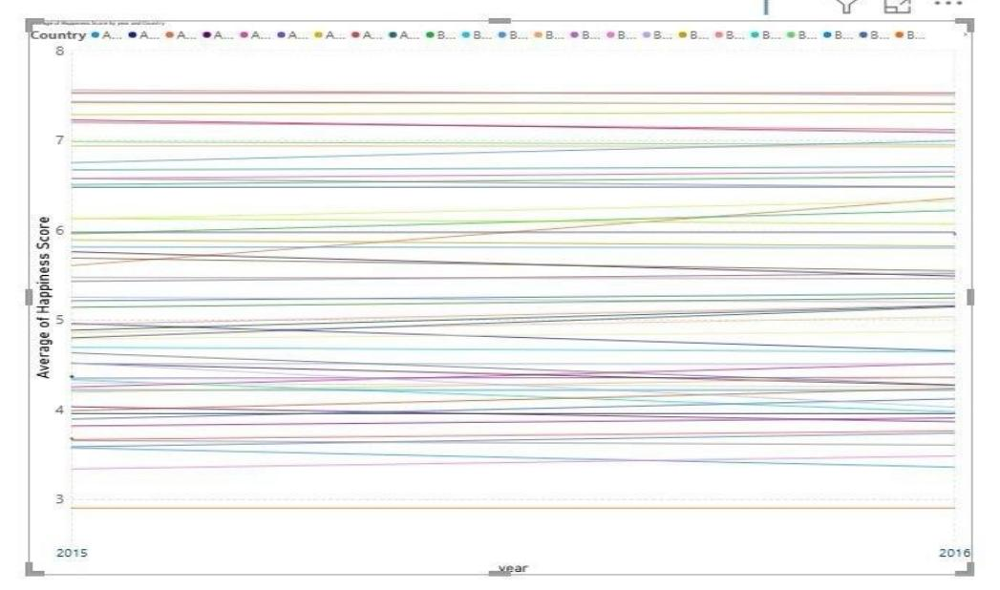
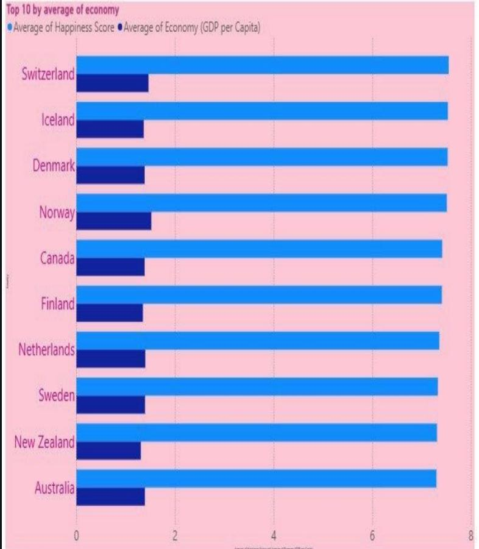
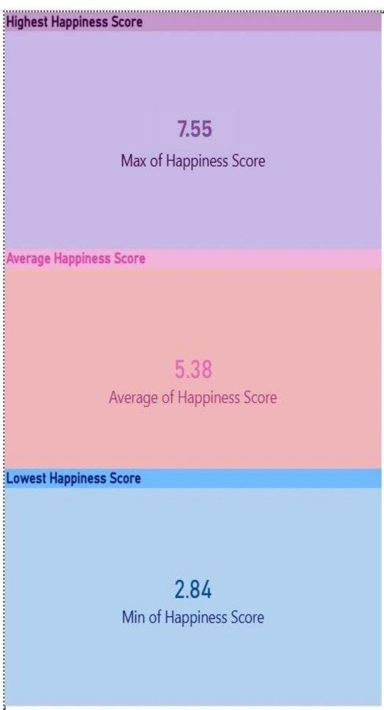
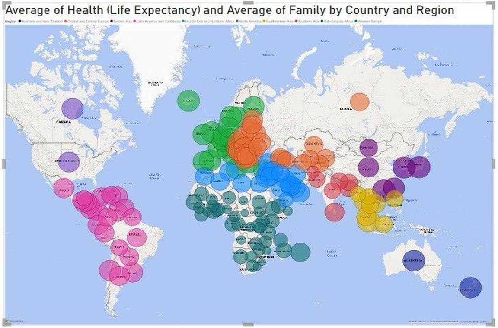

Perfect! Here's the **exact same long README** but with your **actual image names** (the ones you already uploaded). Just copy and paste this directly into your README.md file:

---

## 📝 COPY THIS ENTIRE README:

```markdown
# 😊 Project Happiness – Global Well‑being Analysis (2015–2016)

[](https://powerbi.microsoft.com/)
[](https://github.com/)
[](https://www.kaggle.com/)

---

## 📌 Project Overview

**Project Happiness** is a data storytelling initiative that explores what makes countries happy. Using the **World Happiness Ranking dataset** from Kaggle (2015–2016), we clean, visualize, and interpret global well‑being patterns across **157 countries per year** (314 total records).

> 🎯 **Three main goals:**  
> 
> | Goal | Description |
> |------|-------------|
> | 🔧 **Data Harmony** | Clean raw data – handle missing values, remove unusable columns |
> | 📊 **Visual Joy** | Build an insightful & aesthetic **Power BI dashboard** |
> | 📖 **The Happy Story** | Present findings in a clear **PowerPoint report** |

---

## 📁 Repository Contents

```
world-happiness-analysis-powerbi/
│
├── 📄 Project data science lecture (Happiness).pdf   # Full PowerPoint report (NOT UPLOADED YET)
│
├── 🖼️ Images/
│   ├── Average-of-happiness-score.jpeg              # Average happiness score overview
│   ├── Top-10 Countries-by-Happiness-Score.jpeg     # Top 10 happiest countries
│   ├── Top-10-Countries-by-Economic-Performance.jpeg # Top 10 by GDP per capita
│   ├── Happiness-Score-Distribution.jpeg            # Happiness score stats (min/avg/max)
│   └── Country-&-Region-Health-Family-Analysis.png  # Region health-family analysis
│
├── 📊 dashboard.pbix                                 # Power BI file (interactive - optional)
├── 📄 README.md                                      # You are here
└── 🐍 cleaning_script.py                            # Data cleaning code (optional)
```

---

## 📊 Dataset Structure

| Column | Description | Type |
|--------|-------------|------|
| Country | Nation name | Categorical |
| Region | Geographic/cultural grouping | Categorical |
| Happiness Rank | Global ranking position | Numerical |
| Happiness Score | Overall happiness (0–10 scale) | Numerical |
| Economy | GDP per capita contribution | Numerical |
| Family | Social support & family connections | Numerical |
| Health | Life expectancy & healthcare | Numerical |
| Freedom | Perceived freedom in life choices | Numerical |
| Year | 2015 or 2016 | Numerical |

- **Total records:** 314 (157 per year)
- **Mixed data types:** categorical + numerical scores

---

## 🧹 Data Cleaning Process (Detailed)

We identified and fixed three main data quality issues:

### Issue 1: Zero Values in Continuous Metrics
| Problem | Example | Solution |
|---------|---------|----------|
| Several countries show `0.00` in Health, Family, or Freedom | Central African Republic had `0.000` in Family (2015) – unrealistic | Replace zeros with `NaN` (likely missing data, not true zero) |

### Issue 2: Extreme Outliers
| Problem | Solution |
|---------|----------|
| Very low Economy or Health scores (near-zero values) | Investigate manually – some are real (conflict zones, low-income nations), others are errors |

### Issue 3: Missing Data Handling
| Problem | Solution |
|---------|----------|
| Some columns had **>90% missing values** | Removed entirely to avoid misleading analysis |

✅ **Final dataset:** Clean, consistent, and ready for visualization.

---

## 📈 Power BI Dashboard – Complete Visualizations

### 🖼️ Average Happiness Score Overview



> 📊 **Key Insight:** Visual representation of happiness score distribution across analyzed countries.

---

### 1️⃣ Top 10 Happiest Countries (Bar Chart)


> 🏆 **Key Insight:** Switzerland leads the ranking (**~7.60**), followed closely by Iceland and Denmark. All top 10 countries maintain scores **above 7.25**. Shows consistent happiness leadership among Western European and Anglo-Saxon nations.

---

### 2️⃣ Top 10 Countries by Economic Performance (Bar Chart)



> 💰 **Interesting Finding:** The top 10 countries by economic performance are **identical to the top 10 by happiness score** – strongly suggesting a correlation between economic prosperity and overall happiness.

---

### 3️⃣ Happiness Score Distribution (Statistical Summary)



| Metric | Value |
|--------|-------|
| 📈 Maximum | 7.55 |
| 📊 Average | 5.38 |
| 📉 Minimum | 2.84 |

> **Insight:** Reveals a wide happiness range (**~4.75 points difference**) across countries, with the average (5.38) closer to the midpoint of the scale.

---

### 4️⃣ Country & Region Health-Family Analysis (Detail Table)



> 🌍 **Example Insight:** Sudan (Sub-Saharan Africa) shows relatively low health scores (**0.33**) but moderate family support scores (**0.92**), indicating a potential disconnect between healthcare and social structures in that region.

---

## 🧠 Key Conclusions & Findings

| Finding | Details |
|---------|---------|
| ✅ **Economic Prosperity ≈ Happiness** | Wealthy nations consistently report higher life satisfaction across all metrics |
| 🌍 **Wide Global Range** | Happiness scores vary from **2.84 → 7.55** (global average: **5.38**) |
| 🏆 **Top Performers** | Switzerland, Iceland, Denmark, Norway, Finland dominate both happiness & wealth |
| 📍 **Regional Disparities** | Sub-Saharan Africa shows stronger family support than health metrics |
| 📅 **Yearly Stability** | Countries like Bulgaria maintained consistent scores (~4.22) between 2015-2016 |
| 🔗 **Correlation Identified** | Same 10 nations dominate both happiness and wealth rankings |

---

## 🛠️ Tools & Technologies Used

| Tool | Purpose |
|------|---------|
|  | Dashboard & visualizations |
|  | Data cleaning (pandas, numpy) |
|  | Final report & presentation |
|  | Project hosting |

---

## 📖 How to View This Project

### Option 1: View the Full Report (Recommended)
Download **`Project data science lecture (Happiness).pdf`** – contains all 12 slides with complete analysis. (Coming soon - upload your PDF file)

### Option 2: Explore the Interactive Dashboard
Open **`dashboard.pbix`** in Power BI Desktop (free download from Microsoft) - optional.

### Option 3: Browse Images
Check the images above for all chart screenshots.

---

## 👥 Team Members

| Name | ID |
|------|-----|
| Roaa Haitham Hamada | 20251606023 |
| Jana Hamdy Mohammed | 20251506399 |
| Basmala Hussein Maher | 20251553089 |
| Jana Moustafa Mahmoud | 20251507228 |
| Habiba Ahmed Gomaa | 20251584726 |

---

## 🙏 Acknowledgments

- **Kaggle** – World Happiness Ranking dataset
- **SIM Software Industry & Multimedia** – Project support & guidance

---

## 📄 License

This project is for educational purposes as part of a Data Science course.

---

## ⭐ Show Your Support

If you found this project helpful or interesting, please **star** ⭐ this repository!

---

> 📌 *"Transform data into actionable insights about global well‑being."*

---

### 🔗 Connect With Us

[](https://linkedin.com/)
[](mailto:example@university.edu)

```

---
